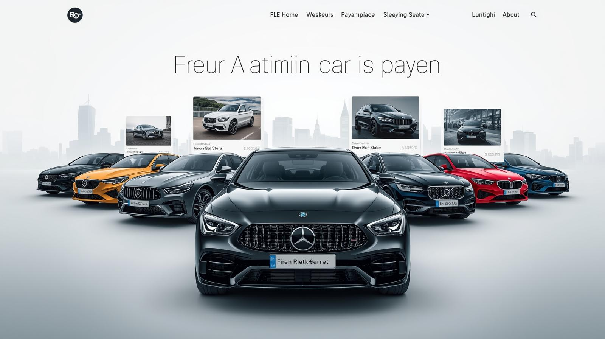

# MotorMint – A Modern Digital Car Marketplace

Welcome to **MotorMint**, a modern digital car marketplace designed to showcase vehicles through a clean, professional interface that reflects how future automotive platforms will look and feel.


# A Modern Automotive Marketplace

MotorMint provides a visually rich and intuitive platform for exploring modern vehicles, combining high-quality visuals with structured car information to create a premium browsing experience.



# Built for Scale and Future Innovation

MotorMint is built as a scalable foundation that developers and teams can extend into a full product, experiment with new features, or adapt for real-world automotive and future Web3 use cases.


---
## Requirements

Before you start, make sure you have these installed on your computer:

- **[Node.js](https://nodejs.org/)** (LTS version recommended) - Download and install from the official website
- **[Git](https://git-scm.com/)** - Used to download the project code

> **Tip:** If you're not sure which Node.js version to install, choose the LTS (Long Term Support) version for the best stability.

---


## How to Run the Project

Follow these simple steps to get MotorMint running on your computer:

### 1. Clone the Repository

```bash
git clone https://github.com/yourusername/motormint.git
```

### 2. Navigate to the Project Folder

```bash
cd motormint
```

### 3. Install Dependencies

```bash
npm install
```

This will download all the necessary files and packages. It might take a minute or two.

### 4. Start the Project

```bash
npm start
```

That's it! 

The project will start automatically. You should see:
- **Frontend** running at `http://localhost:5173`
- **Backend** running at `http://localhost:3000`

Open your browser and visit `http://localhost:5173` to see MotorMint in action!

---

## Notes

**This project is under active development** - New features and improvements are being added regularly.

Feel free to explore the code, customize it to your liking, and make it your own! If you have any questions or suggestions, we'd love to hear from you.

---

**Happy exploring!**
